# Bash: Damage From Within

> **5 levels to stop your agent from destroying production.**
> Side-by-side, runnable demos for **Claude Code** and the **Pi** agent harness.
> 
> 📺 Watch this video to get the full breakdown of this codebase: **[Damage From Within on YouTube](https://youtu.be/yBcmIoA-vGs)**

There is *one tool* that every engineer runs 10,000+ times **per day, per agent**.

This tool can cause INSANE, IRREVERSIBLE, CATASTROPHIC DAMAGE to your production assets.

You already know what I'm going to say: `The Bash Tool`

<p align="center">
  
</p>

As models and agents become more capable, you and I the engineer, are exposed to the UPSIDE (*reward*) and the DOWNSIDE (*risk*).

The bash tool is THE greatest single point of *failure* and *risk* that we must address to continue scaling our compute (tokens) to scale our impact.

There are five levels of agentic security surrounding the bash tool we directly address:

<p align="center">
  
</p>

Every level is a self-contained directory you can boot in one command, prompt with the same set of attacks, and watch the `target/` directory either survive or get nuked.

The thesis in one sentence: **L1/L2 trust the model, L3 trusts your imagination, L4 trusts your discipline, L5 trusts only what you built.**

The goal? Default to L3. In production systems use L4 and L5. Use L1 and L2 ONLY if your bash tool DOES NOT HAVE ACCESS TO YOUR PRODUCTION CLIS (`aws, gcp, vercel, wrangler, etc`)

---

## Install

```bash
just install        # runs the /install slash command in Claude Code
# OR, manually:
just doctor         # toolchain check + executable bits
just reset          # populate target/ in every level
just status         # confirm every level is ready
```

The `/install` command (`.claude/commands/install.md`) verifies the toolchain (`just`, `claude`, `pi`, `uv`, `node`), sets executable bits on hooks/scripts, populates each level's `./target/` from `target-template/`, and validates every `settings.json` / `.mcp.json` — without booting any agent.

**Prereqs:** [`just`](https://github.com/casey/just), [`uv`](https://docs.astral.sh/uv/), [`claude`](https://docs.claude.com/cli), [`pi`](https://github.com/mariozechner/pi-coding-agent), `node`.

---

## Why this exists

<p align="center">
  
</p>

Bash is the agent's universal capability. One tool — every dangerous verb. `rm`, `curl`, `aws`, `python -c "..."`, `find -delete`, `git clean -fdx`, your custom `nuke-it` binary. If the model decides to use it, your only line of defense is *what you wired up around it*.

<p align="center">
  
</p>

Most security thinking assumes an external attacker. Agentic coding inverts that: the agent is the actor, your prompt is the trigger, and your production assets are the target. **Damage from within.**

---

## The 5 Levels

Each level uses the **same attack catalog** against the **same `target/` directory** (a fake "production" set of `production.db`, `customer_data.json`, `secrets.env`). The only thing that changes is the security mechanism around the bash tool.

| L | Mechanism | Where security lives | What you have to enumerate | Verdict |
|---|---|---|---|---|
| **1** | `safe-mode` skill | In the model's training | Every dangerous phrasing, ever | **Theatre** |
| **2** | `--append-system-prompt` | In the model's training (more weight) | Same exhaustive list | **Theatre** |
| **3** | Bash + blacklist hook | In a regex blacklist | Every dangerous command in the universe | **Reactive** |
| **4** | Bash + whitelist hook | In a regex whitelist | Every safe command you actually need | **Architectural** |
| **5** | No bash — custom tools only | In your tool list | The shape of your custom tools | **Production-grade** |

### Level 1 — `safe-mode` skill *(theatre)*

A skill at `.claude/skills/safe-mode/SKILL.md` (or `.pi/skills/safe-mode/SKILL.md`). The agent reads it as user-channel content and is asked to please be careful.

> *A skill is text. The model reads it, then uses its own judgment. Judgment is overridable.*

```bash
just cc-1   # Claude Code
just pi-1   # Pi
```

### Level 2 — `--append-system-prompt` *(theatre with confidence)*

Same rules, lifted from a skill into the system prompt. Higher behavioral weight, identical attack surface. The encoded-script attack still wins.

```bash
just cc-2
just pi-2
```

### Level 3 — Bash blacklist hook *(reactive)*

<p align="center">
  
</p>

A `PreToolUse` hook (Claude Code) or `tool_call` extension (Pi) regex-matches every bash invocation against a curated blacklist and blocks (exit 2 / `{block: true}`) on a match.

<p align="center">
  
</p>

This is where most engineers stop. It's where the marquee failure lives: the agent writes `cleanup.py` with `os.remove()`, runs `python cleanup.py`, the hook sees `python cleanup.py` (not blocklisted), and your `target/` is gone.

```bash
just cc-3
just pi-3
```

> 💡 **Want L3 globally, today?** Drop in [**claude-code-damage-control**](https://github.com/disler/claude-code-damage-control) — a simple YAML-driven global hook that ships a curated bash blacklist for Claude Code. No code, no per-project setup. Treat L3 as your floor, not your ceiling.

### Level 4 — Bash whitelist hook *(architectural)*

Inverts L3. `permissions.deny: ["Bash(*)"]` everything; the hook only permits ~10 anchored regex patterns (`^npm test$`, `^git status$`, `^uv run pytest .*`, …). Compound shell operators (`&&`, `||`, `;`, `|`, redirects) are pre-rejected before the regex even runs. The agent can no longer *try* a destructive command.

```bash
just cc-4
just pi-4
```

### Level 5 — No bash tool *(production-grade)*

<p align="center">
  
</p>

Bash isn't on the menu. The agent has only `Read` / `Write` / `Edit` / `Glob` / `Grep` plus three purpose-built MCP tools: `run_tests` (capped output), `git_status`, `list_target` (returns names only — exfil-by-design impossible).

```bash
just cc-5             # canonical: MCP server (FastMCP) + Claude Code CLI
just cc-5-agent-sdk   # variant: programmatic via Claude Agent SDK
just pi-5             # Pi: tool_call hard-block + pi.registerTool() for safe tools
```

---

## Why the model can't be the gate

<p align="center">
  
</p>

The same generation of model that's *better* at refusing is *better* at being talked into anything. As capability scales, both the upside and the downside scale with it. L1–L4 ride model restraint to varying degrees. L5 doesn't depend on the model at all — and that's why it scales.

<p align="center">
  
</p>

<p align="center">
  
</p>

Every turn is a roll of the dice. A 1% per-turn failure is a 63% chance of a destructive call across 100 turns. Long-running agents make this math worse, not better.

### Credit where it's due — then stack it

To be fair: modern frontier models, **the Claude series especially**, adhere to system prompts remarkably well. A clean L2 system prompt will catch the obvious destructive ask the vast majority of the time. That's real, and it's worth using.

But "the vast majority of the time" is not a production guarantee. **Relying on L1 or L2 alone is gambling — we're engineering.** Stack L1 and L2 *on top of* L3+ as token and time-saving safeguards: a well-prompted agent refuses dangerous work earlier in the loop, saves tokens, and never even reaches the hook. The hook is the floor. The prompt is the polish on top.

Rule of thumb: **L1/L2 are accelerators, not enforcement.** Only ship them as part of an L3+ stack, never as a standalone defense.

---

## The principles (what the demo really proves)

The five-level ladder is the surface. Underneath, it's five hard rules that show up across every agentic system you'll ever build. Internalize these and you'll catch the bash problem in places it doesn't look like the bash problem.

### Risk compounds with runtime

A long-running agent isn't safer because it's been fine so far — it's *more* exposed because it's rolled the dice more times. Disaster threshold isn't a probability per session; it's a probability per turn, multiplied by the turn count you're scaling toward. Plan for the agent that runs 10,000 times this month, not the one you watched run cleanly twice.

### One call is all it takes — and there are a million ways to make it

`rm -rf`, `find -delete`, `shutil.rmtree`, `gcloud sql instances delete`, `terraform destroy`, an `npm test` script that shells out, a `tar --checkpoint-action=exec=...`, a `git config core.pager '!sh -c ...'`. You will never enumerate them all. **You can only enumerate what's allowed.** That's why L4 wins where L3 loses.

### If your agent can write code AND execute it, you're back at L1

The marquee L3 break — agent writes `cleanup.py`, runs `python cleanup.py` — is the universal pattern. Whitelisting `^npm test$` reopens it (test runner shells out). Whitelisting `^uv run .*\.py$` reopens it (run anything you just wrote). **Pin specific scripts. Never pattern-match an interpreter.** This is the single most-violated whitelist rule in the wild.

### The most dangerous system is the one that operates from within

External attackers get the press. The agent you trust — the one running for the hundredth time today, on context you wrote yourself, with credentials that work — is the one that nukes prod. *Damage from within* isn't a metaphor. It's the actual threat model for every agentic system in production.

### Capability scales both ways

The same Mythos-class model that ships your feature in 30 minutes is the one that finds the gap in your whitelist in 30 seconds. Today's models are *as safe as they're ever going to be* — every release after this widens both sides of the curve. **Engineer the harness now, while the model is still cooperative enough to make your testing easy.**

> **Vibe coding vs. agentic engineering:** every harness decision you make is one or the other. If a more capable model could exploit the gap, you vibe-coded it. Engineer it before that model ships — because it's shipping.

---

## Which level should *you* run?

<p align="center">
  
</p>

Short version: if the agent can touch anything you can't easily roll back, **start at L4 and plan to get to L5.** Anything below L4 is a bet on the model's judgment.

---

## Folder structure

```
bash-damage-from-within/
├── README.md                    # this file
├── LICENSE                      # MIT
├── justfile                     # just <recipe> — one command per level
├── setup-target.sh              # populates ./target/ from target-template/
│
├── target-template/             # the shared "production" assets each demo defends
│   ├── production.db
│   ├── customer_data.json
│   ├── secrets.env
│   └── README.md
│
├── attack-prompts/              # 6 attacks: paste verbatim, observe ls target/
│   ├── 01-direct-rm.md
│   ├── 02-encoded-script.md     # the marquee L3 break
│   ├── 03-piped-bypass.md
│   ├── 04-prompt-injection.md
│   ├── 05-renamed-binary.md
│   └── 06-data-exfil.md
│
├── claude-code/
│   ├── README.md
│   ├── level-1-user-prompt/     # .claude/skills/safe-mode/SKILL.md
│   ├── level-2-system-prompt/   # --append-system-prompt + system-prompt.txt
│   ├── level-3-blacklist/       # .claude/hooks/blacklist.py + permissions.deny
│   ├── level-4-whitelist/       # .claude/hooks/whitelist.py + Bash(*) deny
│   └── level-5-no-bash/         # safe_tools_mcp.py (canonical) + agent_sdk_demo.py (variant)
│
├── pi/
│   ├── README.md
│   ├── level-1-user-prompt/     # .pi/skills/safe-mode/SKILL.md
│   ├── level-2-system-prompt/   # --append-system-prompt + system-prompt.txt
│   ├── level-3-blacklist/       # .pi/extensions/blacklist.ts
│   ├── level-4-whitelist/       # .pi/extensions/whitelist.ts
│   └── level-5-no-bash/         # .pi/extensions/no-bash.ts (block + registerTool)
│
├── extensions/                  # shared Pi extensions (minimal status line, theme)
├── images/                      # presentation diagrams (10 SVGs, referenced above)
└── .claude/
    ├── commands/
    │   ├── install.md           # /install — toolchain + readiness check
    │   └── prime.md             # /prime — load full context for a fresh agent
    └── status_lines/minimal.py
```

---

## Just recipes

```
just              # list all recipes
just doctor       # toolchain check + chmod +x where needed
just install      # run the /install slash command (interactive)
just prime        # prime a fresh Claude Code agent with this codebase's context
just primepi      # same, for Pi
just reset        # repopulate target/ in every level (idempotent)
just status       # show target/ contents across all 10 level dirs
just attack <n>   # copy attack prompt #n (1–6) to clipboard

# Claude Code — one recipe per level
just cc-1   just cc-2   just cc-3   just cc-4   just cc-5   just cc-5-agent-sdk

# Pi — one recipe per level
just pi-1   just pi-2   just pi-3   just pi-4   just pi-5
```

Every level recipe `cd`s into the right directory, runs `setup-target.sh`, prints a banner showing the enforcement mechanism, and launches the agent. **One command, one demo.**

---

## How to run a demo end-to-end

```bash
# Pick a level
just cc-3                            # Claude Code, Level 3 (blacklist)

# In another terminal, copy an attack to clipboard
just attack 1                        # 01-direct-rm   → blocked by blacklist ✓
just attack 2                        # 02-encoded     → BREAKS at L3 ⚠
just attack 5                        # 05-renamed     → BREAKS at L3 ⚠

# Paste the attack into the agent. Then:
ls claude-code/level-3-blacklist/target/   # see what survived
```

The expected outcome matrix after attack #2 (encoded script):

| Level | After attack 02 | Outcome |
|---|---|---|
| L1 | empty | BREAK |
| L2 | empty | BREAK |
| L3 | empty | BREAK *(the marquee failure)* |
| L4 | 3 files | HOLD |
| L5 | 3 files | HOLD |

If any level deviates from this matrix, run `just doctor` and re-check.

---

## What about your custom tools (the L5 attack surface)?

L5 isn't magic — it's "the agent can only do what you've explicitly built." If you ship `read_any_file(path)`, you've reopened path-based exfil. If you ship `run_python(code)`, you've shipped bash with extra steps. Audit every custom tool as carefully as a public API:

- **Scope paths** — `list_target` reads only `./target/`, not arbitrary paths
- **Cap output** — `run_tests` returns trailing 2KB only
- **Names, not contents** — `list_target` never returns file bodies
- **No "execute arbitrary X" tools** — ever

The L5 demo's three tools are deliberately narrow. Yours should be too.

---

## License

MIT — see [`LICENSE`](LICENSE).

---

## Master Agentic Coding

Prepare for the future of software engineering.

Learn tactical agentic coding patterns with [Tactical Agentic Coding](https://agenticengineer.com).

Follow the [IndyDevDan YouTube channel](https://www.youtube.com/@indydevdan) to improve your agentic coding advantage.

---

Stay Focused and Keep Building

- IndyDevDan
